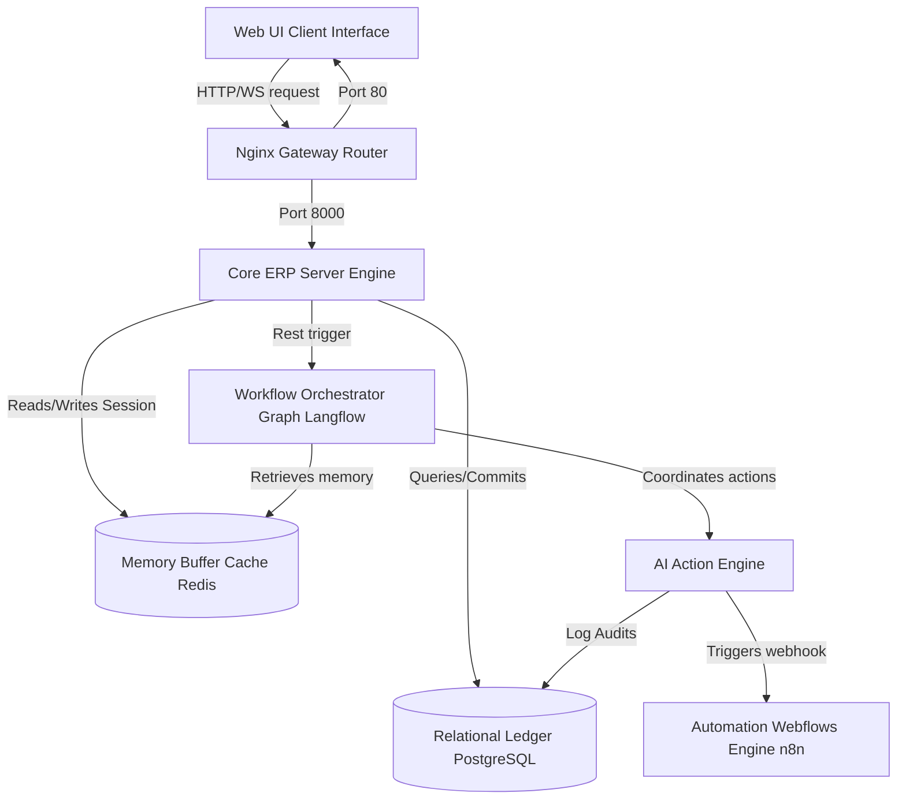

# Nexora AI ERP v4.0 - Enterprise System Architecture

This document outlines the architectural blueprints, execution pipelines, and data orchestration layers of the Nexora AI Factory Operating System.

---

## 1. System Topology Blueprints

The enterprise stack is organized into decoupled layers to guarantee maximum performance, data isolation, and service fallbacks:

---

## 2. Decoupled Modular Layers

### A. Operations Web UI Client Interface (Next.js)
* serves the visual control center for factory managers, operators, and staff.
* Links to the Gateway Router through secure endpoints.

### B. Nginx Gateway Router
* Manages traffic routing, SSL termination, and static asset distribution across frontend and backend applications.

### C. Core ERP Server Engine (FastAPI)
* Implements transactional logic, business rule validations, database schema migrations, and user authentication checks.

### D. Workflow Orchestrator Graph (Langflow)
* Organizes modular reasoning pipelines (Memory retrieval, Intent Classification, Entity Parsing, Tool Routing, and Response Generation).
* Integrates a local python-based runtime emulator to support environments without C-extension build capabilities.

### E. Memory Buffer Cache (Redis)
* Stores transient session data including Chat history sequences (`SessionChatHistory`) and Extracted entities (`SessionEntityMemory`).

### F. AI Action Engine
* Translates conversational decisions into secure database modifications (e.g., Purchase Order drafts, Material Requests, Task assignments, and alerts) using a multi-stage approval workflow.

### G. Relational Ledger (PostgreSQL)
* Serves as the immutable database storage for financial wallets, cash book entries, projects, inventory, staff, and system audit logs.

### H. Automation Workflows Engine (n8n)
* Coordinates outbound channels (Emails, WhatsApp, PDFs, and Spreadsheet synchronization) based on events triggered by the Action Engine.

---

## 3. Data Integration Pipelines

### Multi-Stage Transactional Approval Flow:
1. **User Request:** Raw input is routed to the Core Engine.
2. **Intent Parsing:** Enriched with previous context variables from the Redis memory cache and classified.
3. **Draft Compilation:** The AI Action Engine compiles draft records in `pending` status.
4. **Approval Loop:** AI requests user confirmation.
5. **Execution:** Upon approval, status is updated to `approved` or `active`, committing updates to the relational ledger.
6. **Audit Trail:** Permanently logs execution outcomes in the Audit Log table.
